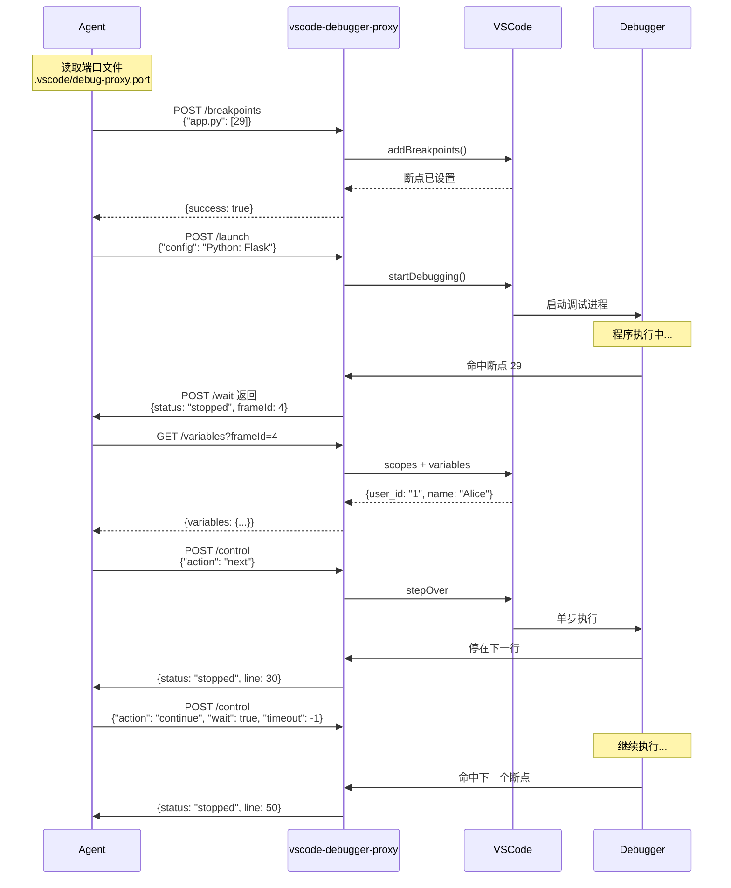
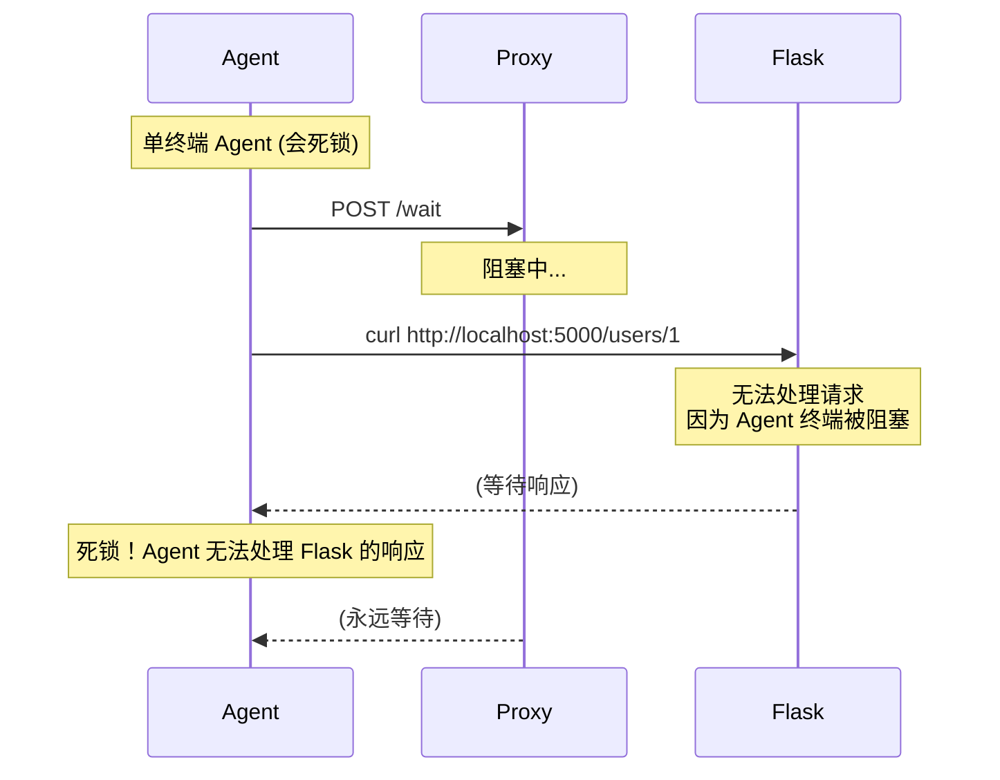
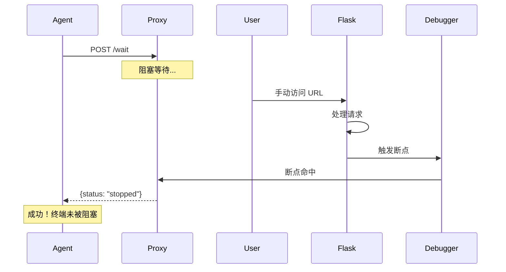
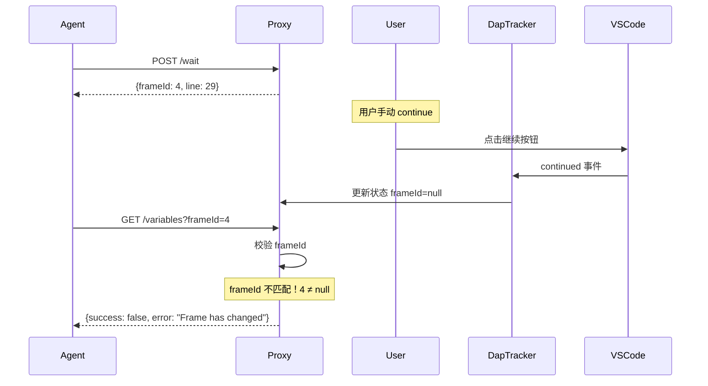

# VSCode Debugger Proxy 系统架构文档

## 一、系统概览

### 1.1 背景与目标

本系统解决闭源 Agent（如 Claude Code for VSCode）无法直接操作 VSCode API 的难题。通过 HTTP 同步阻塞机制，Agent 可以远程控制 VSCode 调试器进行代码调试。

### 1.2 核心组件

```
┌─────────────────────────────────────────────────────────────────────┐
│                        Claude Code for VSCode                          │
│                         (闭源 Agent 客户端)                           │
└─────────────────────────────────┬───────────────────────────────────┘
                                  │ HTTP 请求
                                  ▼
┌─────────────────────────────────────────────────────────────────────┐
│                    vscode-debugger-proxy                              │
│                     (VSCode 扩展插件)                                 │
│  ┌─────────────────┐  ┌─────────────────┐  ┌─────────────────┐       │
│  │  HTTP Server    │  │  StateManager   │  │  DapTracker     │       │
│  │  (端口自动分配)  │  │  (状态协调)      │  │  (DAP 事件拦截)  │       │
│  └────────┬────────┘  └────────┬────────┘  └────────┬────────┘       │
│           │                  │                    │                  │
│           └──────────────────┴────────────────────┘                  │
│                              │                                        │
└──────────────────────────────┼──────────────────────────────────────┘
                               │ VSCode Debug API
                               ▼
┌─────────────────────────────────────────────────────────────────────┐
│                       VSCode 调试器                                    │
│  ┌─────────────────┐  ┌─────────────────┐  ┌─────────────────┐       │
│  │  Breakpoints    │  │  Stack Frames   │  │  Variables      │       │
│  └─────────────────┘  └─────────────────┘  └─────────────────┘       │
└─────────────────────────────────────────────────────────────────────┘
```

### 1.3 文件结构

```
vscode-debugpy-agent-skill/
├── vscode-debugger-proxy/          # VSCode 扩展插件
│   ├── src/
│   │   ├── extension.ts           # 插件入口
│   │   ├── server.ts              # HTTP 服务器
│   │   ├── StateManager.ts        # 状态管理器
│   │   └── DapTracker.ts          # DAP 事件拦截器
│   └── package.json
├── SKILL.md                        # Agent Skills 定义
├── docs/
│   ├── 开发方案.md                  # 开发设计文档
│   ├── 架构文档.md                  # 本文档
│   └── vscode-debugger-proxy-API.md  # API 详细文档
└── test/
    └── test-flask-app/             # 测试用 Flask 应用
```

---

## 二、架构详解

### 2.1 vscode-debugger-proxy 扩展

#### 核心模块

| 模块 | 职责 | 关键实现 |
|------|------|----------|
| `HTTP Server` | 接收 Agent 请求，返回调试状态 | Express.js，端口自动分配 |
| `StateManager` | 协调 HTTP 阻塞与调试事件 | Promise + 状态机 |
| `DapTracker` | 拦截 DAP 协议消息 | `DebugAdapterTracker` API |

#### 状态机

```
                    ┌─────────────┐
                    │  stopped    │◄──────────────┐
                    └──────┬──────┘               │
                           │ waitForState()        │
                           ▼                       │
                    ┌─────────────┐               │
         continue   │  running    │───────────────┤
        ──────────►│             │   stopped     │
                    └─────────────┘   (breakpoint)│
                           │                       │
                           │ next/stepIn/stepOut   │
                           ▼                       │
                    ┌─────────────┐               │
                    │  stopped    │───────────────┘
                    │   (step)    │
                    └─────────────┘
```

### 2.2 端口分配机制

```
┌──────────────────────────────────────────────────────────────┐
│                    端口分配流程                                 │
└──────────────────────────────────────────────────────────────┘

扩展启动
    │
    ▼
┌─────────────────────────┐
│ findAvailablePort(4711)   │
└───────────┬─────────────┘
            │
            ▼
    ┌───────────────┐
    │ 端口被占用？    │───是───► findAvailablePort(port+1)
    └───────┬───────┘
            │ 否
            ▼
    ┌───────────────┐
    │  启动服务器    │
    └───────┬───────┘
            │
            ▼
    ┌───────────────┐
    │ 写入端口文件   │
    │ .vscode/      │
    │ debug-proxy.port│
    └───────────────┘
```

### 2.3 文件格式

**端口文件**: `.vscode/debug-proxy.port`
```
54321
```

### 2.4 DapTracker - DAP 事件拦截器

#### 什么是 DapTracker

DapTracker（Debug Adapter Tracker）是 VSCode 扩展中用于拦截调试适配器协议（Debug Adapter Protocol, DAP）消息的组件。

#### 为什么需要 DapTracker

VSCode 调试 API 本身不提供直接的回调机制来感知"断点命中"等事件。通过 DapTracker 拦截 DAP 协议消息，我们可以获取：
- 调试器何时停止（stopped 事件）
- 停止的原因（breakpoint、step、exception 等）
- 当前的堆栈帧信息（file、line、frameId）

#### 核心职责


1. **监听用户操作**：检测用户对调试器的操作（继续、单步、停止等）
2. **检测状态变化**：检测调试器状态变化（断点命中、异常、单步完成等）
3. **同步状态更新**：将这些事件同步到 StateManager

#### DAP 事件类型

| 事件 | 触发时机 | 说明 |
|------|----------|------|
| `stopped` | 断点命中、单步完成、异常、暂停 | 调试器停止运行 |
| `continued` | 用户点击继续或单步后 | 调试器恢复运行 |
| `terminated` | 会话结束 | 调试会话被终止 |
| `exited` | 进程退出 | 被调试进程退出 |
| `thread` | 线程变化 | 线程创建或退出 |

#### 停止原因（stopped.reason）

| 原因 | 说明 |
|------|------|
| `breakpoint` | 命中断点 |
| `step` | 单步操作完成 |
| `exception` | 抛出异常 |
| `entry` | 停在程序入口 |
| `pause` | 用户暂停 |

#### 代码位置

`vscode-debugger-proxy/src/DapTracker.ts`

#### 关键实现

```typescript
// 注册 DapTracker 工厂，拦截所有调试类型的 DAP 消息
vscode.debug.registerDebugAdapterTrackerFactory('*', {
    createDebugAdapterTracker(session) {
        return {
            onWillStartSession: () => { /* 调试开始 */ },
            onWillStopSession: () => { /* 调试结束 */ },
            onDidSendMessage: (message) => {
                if (message.event === 'stopped') {
                    // 拦截停止事件，获取断点位置
                    const frame = await session.customRequest('stackTrace', {...});
                    updateState({ file: frame.source.path, line: frame.line });
                }
            }
        };
    }
});
```

---

## 三、API 接口

### 3.1 接口列表

| 接口 | 方法 | 阻塞 | 功能 |
|------|------|------|------|
| `/health` | GET | 否 | 健康检查 |
| `/status` | GET | 否 | 获取调试状态 |
| `/breakpoints` | POST | 否 | 设置断点 |
| `/launch` | POST | **是** | 启动调试 |
| `/relaunch` | POST | **是** | 重新启动调试 |
| `/wait` | POST | **是** | 等待断点命中 |
| `/control` | POST | **是** | 单步/继续 |
| `/variables` | GET | 否 | 获取变量 |
| `/stacktrace` | GET | 否 | 获取栈帧 |
| `/stop` | POST | 否 | 停止调试 |

### 3.2 请求响应格式

**断点设置请求**:
```json
{
  "/path/to/app.py": [29, 30],
  "/path/to/utils.py": [10]
}
```

**Wait 响应**:
```json
{
  "success": true,
  "status": "stopped",
  "reason": "breakpoint",
  "file": "/path/to/app.py",
  "line": 29,
  "frameId": 4,
  "message": "Stopped at /path/to/app.py:29 (breakpoint)"
}
```

---

## 四、调试时序流程

### 4.1 完整调试流程



### 4.2 单终端 Agent 死锁风险



**解决方案**: 单终端 Agent 必须使用 `/wait` + 外部触发机制



### 4.3 状态同步与 frameId 校验



---

## 五、Agent 使用流程

### 5.1 标准工作流

```mermaid
flowchart TD
    A[读取 .vscode<br/>debug-proxy.port] --> B[连接 Proxy<br/>http://localhost:xxxx]
    B --> C[设置断点<br/>/breakpoints]
    C --> D[启动调试<br/>/launch]
    D --> E{程序停止？}
    E -->|是| F[获取变量<br/>/variables]
    F --> G[分析代码]
    G --> H{需要继续？}
    H -->|单步| I[/control next]
    I --> E
    H -->|到下一断点| J[/control continue]
    J --> E
    E -->|超时| K[处理超时]
    H -->|完成| L[结束]
```

### 5.2 典型调试场景

**场景：调试 Flask 应用**

```bash
# 1. 读取端口
cat .vscode/debug-proxy.port  # 输出: 54321

# 2. 设置断点
curl -X POST http://localhost:54321/breakpoints \
  -H "Content-Type: application/json" \
  -d '{"d:/project/app.py": [29]}'

# 3. 启动调试
curl -X POST http://localhost:54321/launch \
  -H "Content-Type: application/json" \
  -d '{"config": "Python: Flask"}'

# 4. 等待断点命中（阻塞）
curl -X POST http://localhost:54321/wait

# 5. 查看变量
curl "http://localhost:54321/variables?frameId=4"

# 6. 单步执行
curl -X POST http://localhost:54321/control \
  -H "Content-Type: application/json" \
  -d '{"action": "next"}'

# 7. 继续到下一断点
curl -X POST http://localhost:54321/control \
  -H "Content-Type: application/json" \
  -d '{"action": "continue", "wait": true, "timeout": -1}'
```

---

## 六、安全与限制

### 6.1 安全机制

1. **frameId 校验**: 所有操作携带 frameId，防止状态不一致
2. **调试器状态检查**: 操作前验证调试器是否活动
3. **文件存在性检查**: 设置断点前验证文件路径

### 6.2 限制

| 限制 | 说明 |
|------|------|
| 端口文件位置 | 仅支持第一个 workspace folder |
| 断点格式 | 仅支持源码行断点，不支持条件断点 |
| 多调试会话 | 仅支持单个活动调试会话 |
| 跨窗口 | 不支持控制其他 VSCode 窗口的调试器 |

---

## 七、部署与配置

### 7.1 安装扩展

```bash
cd vscode-debugger-proxy
npm install
npm run compile
# F5 在 VSCode 中调试
```

### 7.2 发布扩展

```bash
npm install -g @vscode/vsce
vsce package
vsce create-publisher <publisher-name>
vsce publish
```

### 7.3 Agent 配置

Agent 需要在连接前读取 `.vscode/debug-proxy.port` 获取端口。

---

## 八、版本历史

| 版本 | 日期 | 变更 |
|------|------|------|
| 0.1.0 | 2026-03-22 | 初始版本，支持基础调试功能 |
